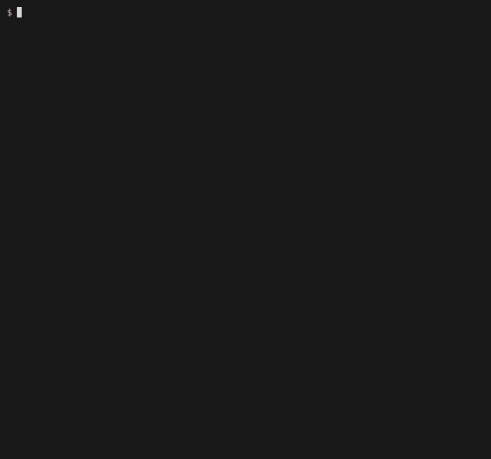

# [ OWASP Amass](https://owasp.org/www-project-amass/)

----

  

----

The OWASP Amass Project has developed a tool to help information security professionals perform network mapping of attack surfaces and perform external asset discovery using open source information gathering and active reconnaissance techniques.

**Information Gathering Techniques Used:**

* **DNS:** Basic enumeration, Brute forcing (optional), Reverse DNS sweeping, Subdomain name alterations/permutations, Zone transfers (optional)
* **Scraping:** Ask, Baidu, Bing, DNSDumpster, DNSTable, Dogpile, Exalead, Google, HackerOne, IPv4Info, Netcraft, PTRArchive, Riddler, SiteDossier, ViewDNS, Yahoo
* **Certificates:** Active pulls (optional), Censys, CertSpotter, Crtsh, Entrust, GoogleCT
* **APIs:** AlienVault, BinaryEdge, BufferOver, CIRCL, CommonCrawl, DNSDB, GitHub, HackerTarget, IPToASN, Mnemonic, NetworksDB, PassiveTotal, Pastebin, RADb, Robtex, SecurityTrails, ShadowServer, Shodan, Spyse (CertDB & FindSubdomains), Sublist3rAPI, TeamCymru, ThreatCrowd, Twitter, Umbrella, URLScan, VirusTotal, WhoisXML
* **Web Archives:** ArchiveIt, ArchiveToday, Arquivo, LoCArchive, OpenUKArchive, UKGovArchive, Wayback

----

## Documentation

Use the [Installation Guide](./doc/install.md) to get started.

Go to the [User's Guide](./doc/user_guide.md) for additional information.

See the [Tutorial](./doc/tutorial.md) for example usage.

## Community

### Project Leader

* OWASP: [Caffix](https://www.owasp.org/index.php/User:Caffix)
* GitHub: [@caffix](https://github.com/caffix)

### Contributors

This project improves thanks to all the people who contribute:

## Top Mentions

* [SANS ISC: Offensive Tools Are For Blue Teams Too](https://isc.sans.edu/forums/diary/Offensive+Tools+Are+For+Blue+Teams+Too/25842/)
* [How to Use OWASP Amass: An Extensive Tutorial](https://www.dionach.com/blog/how-to-use-owasp-amass-an-extensive-tutorial/)
* [10 Recon Tools For Bug Bounty](https://medium.com/@hackbotone/10-recon-tools-for-bug-bounty-bafa8a5961bd)
* [Bug Bounty Tips: Amass Recon Tool](https://www.youtube.com/watch?v=QRkKzYH4efI)
* [OWASP Amass OSINT Reconnaissance](https://medium.com/hacker-toolbelt/owasp-amass-osint-reconnaissance-9b57d81fb958)
* [Top Linux Distros for Ethical Hacking and Penetration Testing](https://securitytrails.com/blog/top-linux-distributions-ethical-hacking-pentesting)
* [Asset Enumeration: Expanding a Target's Attack Surface](https://captmeelo.com/bugbounty/2019/09/02/asset-enumeration.html)
* [Commando VM 2.0: Customization, Containers, and Kali, Oh My!](https://www.fireeye.com/blog/threat-research/2019/08/commando-vm-customization-containers-kali.html)
* [amass — Automated Attack Surface Mapping](https://danielmiessler.com/study/amass/)
* [My Recon Process — DNS Enumeration](https://medium.com/@noobhax/my-recon-process-dns-enumeration-d0e288f81a8a)
* [Search subdomains and build graphs of network structure with Amass](https://miloserdov.org/?p=2309)
* [The Bug Hunters Methodology v3(ish)](https://www.youtube.com/watch?v=Qw1nNPiH_Go)
